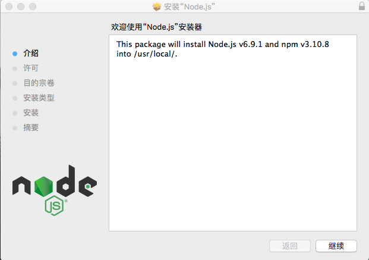
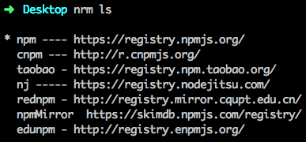
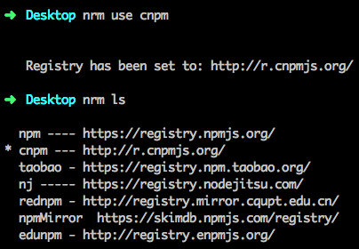

## 1.1.1 安装 Node.js

有三种方式安装 Node.js：一是通过安装包安装，二是通过源码编译安装，三是在 Linux 下可以通过 yum|apt-get 安装，在 Mac 下可以通过 [Homebrew](http://brew.sh/) 安装。对于 Windows 和 Mac 用户，推荐使用安装包安装，Linux 用户推荐使用源码编译安装。

#### Windows 和 Mac 安装：

**第一步：**

打开 [Node.js 官网](https://nodejs.org/en/)，可以看到以下两个下载选项：


左边的是 LTS 版，用过 ubuntu 的同学可能比较熟悉，即长期支持版本，大多数人用这个就可以了。右边是最新版，支持最新的语言特性（比如对 ES6 的支持更全面），想尝试新特性的开发者可以安装这个版本。我们选择左边的 v6.9.1 LTS 点击下载。

> 小提示：从 [http://node.green](http://node.green) 上可以看到 Node.js 各个版本对 ES6 的支持情况。

**第二步：**

安装 Node.js，这个没什么好说的，一直点击 `继续` 即可。



**第三步：**

提示安装成功后，打开终端输入以下命令，可以看到 node 和 npm 都已经安装好了：


#### Linux 安装：

Linux 用户可通过源码编译安装：

```
curl -O https://nodejs.org/dist/v6.9.1/node-v6.9.1.tar.gz
tar -xzvf node-v6.9.1.tar.gz
cd node-v6.9.1
./configure
make
make install
```

> 注意: 如果编译过程报错，可能是缺少某些依赖包。因为报错内容不尽相同，请读者自行求助搜索引擎或 [stackoverflow](http://stackoverflow.com/)。

## 1.1.2 n 和 nvm

通常我们使用稳定的 LTS 版本的 Node.js 即可，但有的情况下我们又想尝试一下新的特性，我们总不能来回安装不同版本的 Node.js 吧，这个时候我们就需要 [n](https://github.com/tj/n) 或者 [nvm](https://github.com/creationix/nvm) 了。n 和 nvm 是两个常用的 Node.js 版本管理工具，关于 n 和 nvm 的使用以及区别，[这篇文章](http://taobaofed.org/blog/2015/11/17/nvm-or-n/) 讲得特别详细，这里不再赘述。

## 1.1.3 nrm

[nrm](https://github.com/Pana/nrm) 是一个管理 npm 源的工具。用过 ruby 和 gem 的同学会比较熟悉，通常我们会把 gem 源切到国内的淘宝镜像，这样在安装和更新一些包的时候比较快。nrm 同理，用来切换官方 npm 源和国内的 npm 源（如: [cnpm](http://cnpmjs.org/)），当然也可以用来切换官方 npm 源和公司私有 npm 源。

全局安装 nrm:

```
npm i nrm -g
```

查看当前 nrm 内置的几个 npm 源的地址：



切换到 cnpm：



下一节：[1.2 MongoDB 的安装与使用](https://github.com/hedahang/myblog/blob/master/book/1.2%20MongoDB%20%E7%9A%84%E5%AE%89%E8%A3%85%E4%B8%8E%E4%BD%BF%E7%94%A8.md)